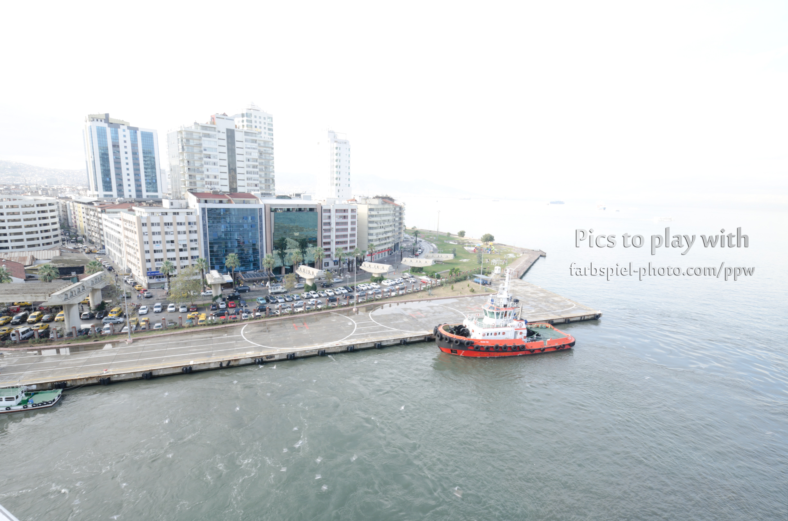
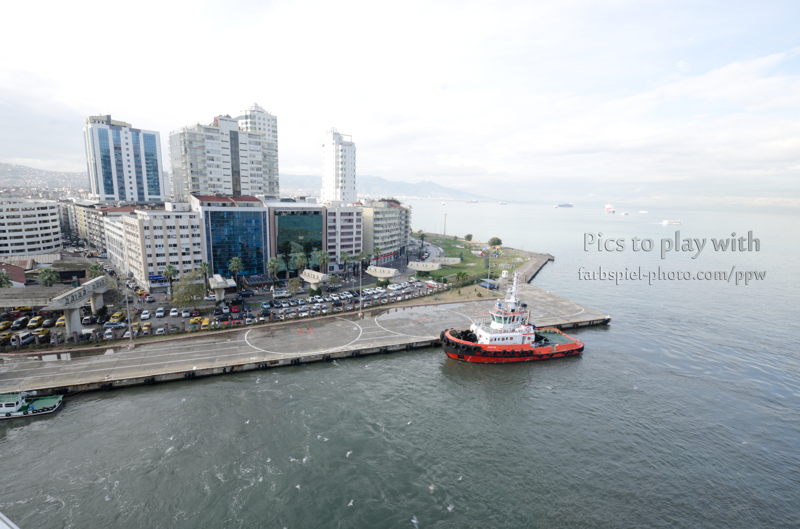
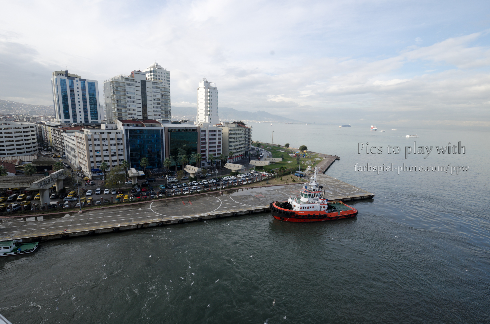
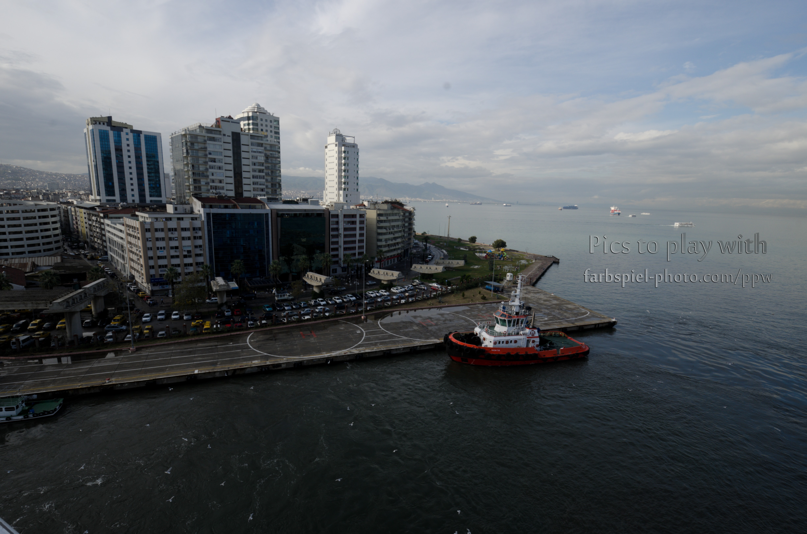
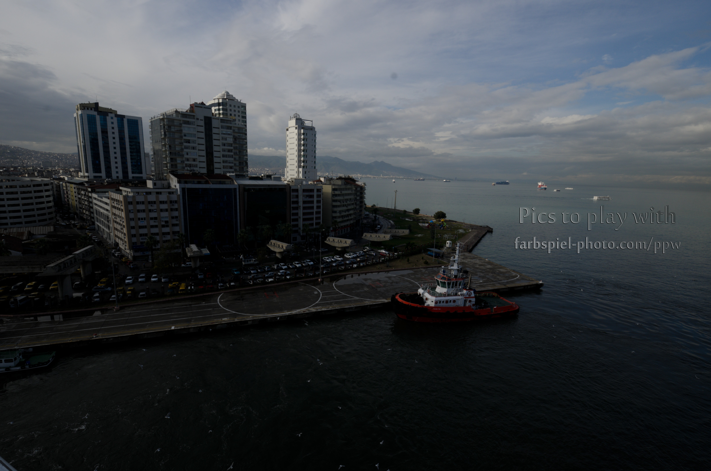
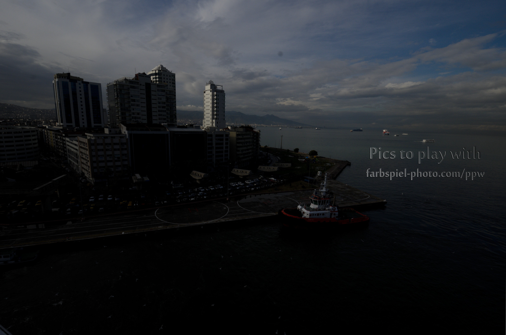
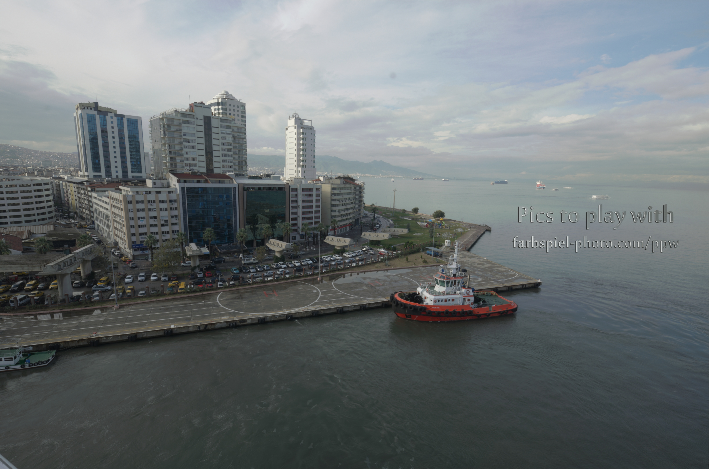

# AlignHDRToolkit

The toolkit of HDR synthesis approaches based on alignment methods developed by [Galaxies99](https://github.com/galaxies99/).

## Requirements

- Python 3.7+

- Numpy
- Tqdm
- OpenCV 4.4.0+, including
  - opencv-python
  - opencv-contrib-python
  - opencv-contrib-python-headless
  - opencv-contrib-python-nonfree

## Getting Started

### Dataset Preparation

You can refer to [farbspiel photography](https://farbspiel-photo.com/learn/hdr-pics-to-play-with) to get HDR image dataset. Follow the instruction in **Dataset** part.

You are expected to arrange the dataset as follows if you are using our demo.

```
data
├── Scene1
|   ├── *.jpg/png/... (image 1)
|   ├── *.jpg/png/... (image 2)
|   ├── ...
|   ├── *.jpg/png/... (image N)
|   ├── (reference.info)
|   └── (exposure.info)
├── Scene2
|   ├── *.jpg/png/... (image 1)
|   ├── *.jpg/png/... (image 2)
|   ├── ...
|   ├── *.jpg/png/... (image N)
|   ├── (reference.info)
|   └── (exposure.info)
├── ...
└── SceneM 
    ├── *.jpg/png/... (image 1)
    ├── *.jpg/png/... (image 2)
    ├── ...
    ├── *.jpg/png/... (image N)
    ├── (reference.info)
    └── (exposure.info)
```

The *optional* `exposure.info` file in every scene is expected to have this format.

```
[image1_filename] [exposure_time] [other_info]
[image2_filename] [exposure_time] [other_info]
...
[imageN_filename] [exposure_time] [other_info]
```

where,

- `[image_filename]` is the image filename, which should be <u>a string not contains space</u>;
- `[exposure_time]` is the exposure time, which should be a floating number of integer. <u> Suppose the exposure time is 1/x sec, you are expected to fill x in this block</u>;
- `[other_info]` is other information, not necessary;
- Every two consecutive parts should be divided by <u>only one space</u>;
- Remember to add a 'enter' character at the end of the file;
- If you do not have one, never mind, we can automatically detect the exposure time.

The *optional* `reference.info` file in every scene only contains the filename of the referencing image.

### Demo

 You may run `main.py` as the demo program. To run the program, you may prepare the following dataset: `'Big_City_Lights', 'Hall', 'High_Five', 'Izmir_Harbor', 'The_Marble_Hall'`. You can find them in the previous website. After preparing these dataset, use the following command to run the demo.

```shell
python main.py
```

### Function Call

You may import `HDR` from this folder, then use the following APIs to get what you want.

- `hdrSynthesis(images, exposures, ref_id, aligner, merger)`, you may find the method of the aligner and merger in the **Alignment methods** part and **Merger method** part respectively; the `images` and `exposures` are the data of the photos of different exposures; the `ref_id` arguments is the reference images (if no reference image, `ref_id` is `None`). This function will return an HDR image after synthesis.
- `hdrTonemapping(hdr, tonemapper)`, you may find the method of tonemapping in the **Tonemapping methods** part;  the `hdr` argument is the HDR picture which needs tonemapping.

[***Example***]

```python
import HDR
from models import aligner, merger, tonemapper
hdr_img = HDR.hdrSynthesis(images, exposures, None, aligner=aligner.AlignerFeaturesSIFT())
ldr_img_after_tonemapping = HDR.hdrTonemapping(hdr_img, 
               tonemapper=tonemapper.TonemapperReinhard(gamma=1.5, intensity=0, light_adapt=0, color_adapt=0))
```

## Demo Sample

The `sample` folder show the result of `Izmir Harbor` images synthesis.

**Original Image**

<table>
  <tr><td></td><td></td><td></td><td></td><td></td><td></td></tr>
  <tr><td align="center">1/15 s</td><td align="center">1/30 s</td><td align="center">1/60 s</td><td align="center">1/100 s</td><td align="center">1/200 s</td><td align="center">1/400 s</td></tr>
</table>

**HDR Synthesis Result** (after tonemapping)



## Methods Introductions

### Alignment Methods

We provided the following alignment method in `alignment.py`, and you are free to choose the method you want to use.

- **MTB** (`AlignMTB(**kwargs)`): MTB alignment method, which is the built-in method of OpenCV; `**kwargs` are the arguments of  `cv2.createAlignMTB()`.
- **MTB-Pyramid** (`AlignMTBPyramid(grey_approx, threshold_range, ref_id)`): MTB-Pyramid alignment method published by G Ward [1]; `grey_approx` is the grey approximation methods, `threshold_range` is the median threshold range, and the `ref_id` is the referencing image ID.
- **Feature-based ORB** (`AlignFeatureORB(min_matches, match_percent, **kwargs)`) ***(default)***: Feature-based ORB alignment method published by E Rublee [2]; `min_matches` is the minimum matching pairs, `match_percent` is the percentage of chosen matching pairs, and `**kwargs` are the argument of `cv2.ORB_create()`.
- **Feature-based SIFT** (`AlignFeatureSIFT(min_matches, match_percent, **kwargs)`): Feature-based SIFT alignment method published by DG Lowe [3]; `min_matches` is the minimum matching pairs, `match_percent` is the percentage of chosen matching pairs, and `**kwargs` are the argument of `cv2.xfeatures2d.SIFT_create()`. We only use SIFT for academic purpose.
- **ECC** (`AlignECC(warp_mode, iteration, terminal_eps, guassFilterSize)`): Enhanced Correlation Coefficient (ECC) Maximization method published by GD Evangelidis [4]; `warp_mode` is the warping mode in ECC (one of `cv2.MOTION_AFFINE`, `cv2.MOTION_TRANSLATION`, `cv2.MOTION_EUCLIDEAN` and `cv2.MOTION_HOMOGRAPHY`); `iteration` is the iteration times, `terminal_eps` is the terminating epsilon, `guassFilterSize` is the size of the guass filter used in ECC.

### Merger Methods

We provide the following merger method in `merger.py`, and you may use the `method` argument to choose the method you want to use.

- **Debevec** (`MergerDebevec(**kwargs)`) ***(default)***: Debevec merge method, which is the built-in method of OpenCV; `**kwargs` are the arguments of  `cv2.createCalibrateDebevec()`.
- **Robertson** (`MergerRobertson(**kwargs)`): Robertson merge method, which is the built-in method of OpenCV; `**kwargs` are the arguments of  `cv2.createCalibrateRobertson()`.
- **Mertens** (`MergerMertens(**kwargs)`): Mertens merge (fake HDR) method, which is the built-in method of OpenCV; it's worth noticing that this method produces fake HDR (that is, not real HDR, only looks like HDR) pictures; `**kwargs` are the arguments of  `cv2.createMergeMertens()`.

### Tonemapping Methods

We provided the following tonemapping method in `tonemapping.py`, and you may use the `method` argument to choose the method you want to use.

- **Drago** (`TonemapperDrago()`): Drago tonemapping method, which is the built-in method of OpenCV; `**kwargs` are the arguments of  `cv2.createTonemapDrago()`.
- **Reinhard** (`TonemapperReinhard()`) ***(default)***: Reinhard tonemapping method, which is the built-in method of OpenCV; `**kwargs` are the arguments of  `cv2.createTonemapReinhard()`.
- **Mantiuk** (`TonemapperMantiuk()`): Mantiuk tonemapping method, which is the built-in method of OpenCV; `**kwargs` are the arguments of  `cv2.createTonemapMantiuk()`.

## References

[1] Ward, Greg. "Fast, robust image registration for compositing high dynamic range photographs from hand-held exposures." *Journal of graphics tools* 8.2 (2003): 17-30.

[2] Rublee, Ethan, et al. "ORB: An efficient alternative to SIFT or SURF." *2011 International conference on computer vision*. Ieee, 2011.

[3] Lowe, David G. "Distinctive image features from scale-invariant keypoints." *International journal of computer vision* 60.2 (2004): 91-110.

[4] Evangelidis, Georgios D., and Emmanouil Z. Psarakis. "Parametric image alignment using enhanced correlation coefficient maximization." *IEEE Transactions on Pattern Analysis and Machine Intelligence* 30.10 (2008): 1858-1865.